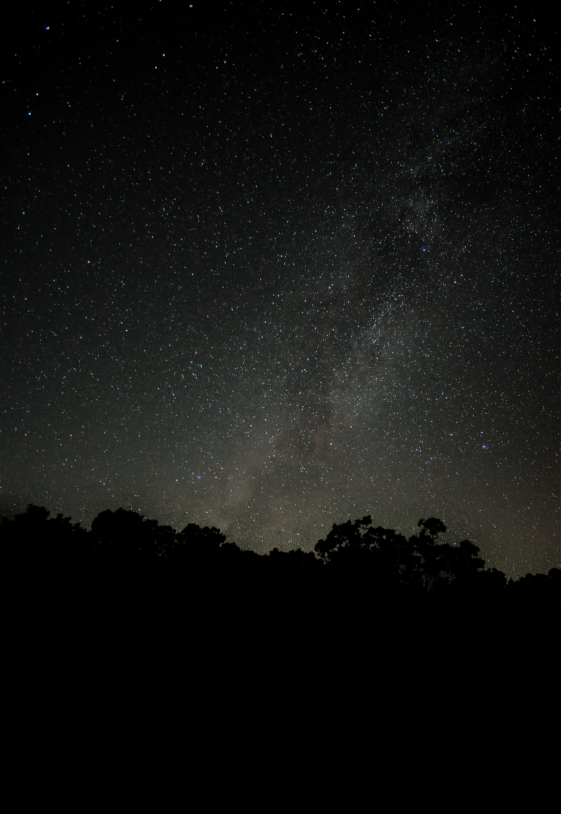

# Astro-Correction-Tool

Corrects size and color of stars

Explanation of controls

Load Image - Select file to edit and display

Sigma X - Adjusts the movement of abberations on the X axis (generally half that of the Y value)

Sigma Y - Adjusts the movement of abberations on the Y axis (generally double that of the X value)

PSF Size - Adjusts the PSF value (use lower values for better quality but less of an effect)

Iterations - # of times a denoise algorithm is ran (the correction causes noise, so this step is necessary to retain quality)

Filters - Self explanitory. If still applying after deselected, reselect and move value to 0.

Process Image - Uses GPU if available to speed processing. Displays and saves the new image in same folder with _edit suffix.

